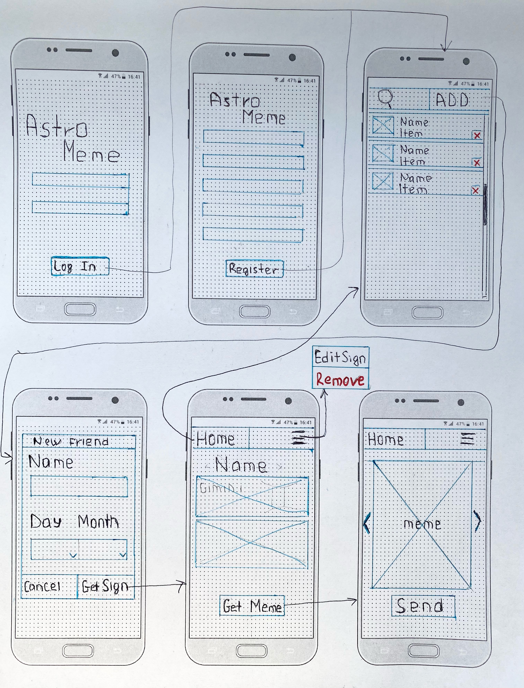

# AstroMeme
An application focused on astrology and memes based off of them!
## Table of Contents
1. [Overview](#Overview)
1. [Product Spec](#Product-Spec)
1. [Wireframes](#Wireframes)
2. [Schema](#Schema)

## Overview
### Description
Imaging a situation where you meet a vary interesting person online. In these virtual pandemic settings all you can do is to pretty much talk or text. The conversation topics and jokes are running dry. But no worries if you only know the horoscope sign of you conversation companion, with our app you will be able to quickly and continuously generate memes based on the horoscope sign of a person, which you can then text or share. 

### App Evaluation
[Evaluation of your app across the following attributes]
- **Category: Social media/Enterteinment**
- **Mobile:**
    - Our app will send push down notifications to users who receive a meme.
- **Story:**
    - The story behind this app is very compelling because it is simple and straightforward to the point. Our friends have reacted positively to it, affirming that they have been in the situation before where they could not come up with good joke to continue conversation.
- **Market:**
    - We expect the market size for this app to be very large because it appeals to wide age range and does not really target one specific niche. However, we do think the app could be more popular with younger generation of high school students to college graduates and young adults as they seem to spend more conversing on social media platforms or over text.
- **Habit:**
    - We see the app idea as having a potential to be habit forming because we have an option to save persons name and horoscope sign to come back to generate memes when you are talking to that person again. We also give users the power to create memes which allow them to become more invested in our app.
- **Scope:**
    - The app idea seems to be somewhat challenging.  However, to tackle that we decided to work our way from the bottom up so that we make sure we can complete well-working version by the end of the program. Therefore, we clearly defined the product idea and was able to come up with solid clear user flow, API configuration and technical requirements.

## Product Spec

### 1. User Stories (Required and Optional)

**Required Must-have Stories**

* User can log into their account
* User can create a new account
* User can find their astrological sign
* User can get information about their astrological sign
* User can create memes based on astrolgical sign
* User can save meme on phone
* User can share memes with others

**Optional Nice-to-have Stories**

* User can get from memes Reddit/Twitter based on astrological sign

### 2. Screen Archetypes

* Login Screen
   * User can log into their account
* Sign Up Screen
   * User can create a new account
* Sign Finding Screen
    * User can find their astrological sign
* Sign Display Screen
    * User can get information about their astrological sign
* Generate Meme Screen
    * User can create memes based on astrolgical sign
* Send Meme Screen
    * User can save meme on phone
    * User can share memes with others

### 3. Navigation

**Tab Navigation** (Tab to Screen)

* Astrogical Sign Information
* Generating a Meme

**Flow Navigation** (Screen to Screen)

* Login Screen
   * => Sign Finding screen
   * => Sign Up screen
* Sign Up Screen
   * => Sign Finding Screen
* Sign Finding Screen
    * => Sign Display Screen
* Sign Display Screen
    * => Generate Meme Screen
* Generate Meme Screen
    * => Sign Finding Screen
    * => Send Meme Screen
* Send Meme Screen
    * None

## Wireframes

### [BONUS] Digital Wireframes & Mockups

### [BONUS] Interactive Prototype

## Schema 
[This section will be completed in Unit 9]
### Models
[Add table of models]
### Networking
- [Add list of network requests by screen ]
- [Create basic snippets for each Parse network request]
- [OPTIONAL: List endpoints if using existing API such as Yelp]

## Schema 
### Models
#### Post

   | Property      | Type     | Description |
   | ------------- | -------- | ------------|
   |userName| String| Name of user of application|
   | userId| Number| Unique identifier for user |
   | friendName  | String |Name of friend in the list|
   |  friendBDay|Date| Date of the friend in the list|
   |  sign|String| Astrological Sign of the friend from the friend list|
   |  memeId| Number|meme that is being processed|
   |     |    |  |
   |     |  |  |
### Networking
#### List of network requests by screen
   - General list so far (may be broken down)
      - (Read/GET) Get an astrological sign based on date entered 
      - (Create/POST) Create new friend field with astrological sign attached to him/her
      - (Delete) Delete existing friend 
      - (Create/POST) Create a new meme based on friends sign 
      - (Delete) Delete existing comment
      - (Read/GET) Query logged in user object
      - (Update/PUT) Update/Edit friends sign information

### Build Sprint 1
- [x] Sign In XML 
- [x] Sign Up XML
- [x] Designed and created art for the app
- [x] Set up initial tables in Parse database 

