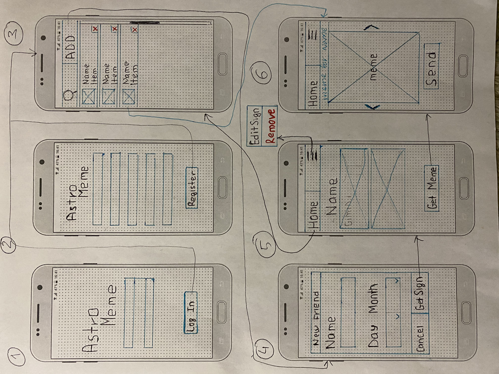

### UML diagram to match wireframe screens to XML files and Java classes

The purpose of this document is the internal reference to make coloboration easier. On the attached wireframe screens are numbered and below is are names of XML files corresponding to each screen number. This should make it easier to navigate the project while adding classes to it.
As we continue to work on creating and adding classes and files to the project it will be nice to update this document as needed to simplify communication.

#### 1. Login 
|login.xml| 
|---------------|
| userId|
|pswd|
|logInBtn|
|initSignUpBtn|
#### 2. Sign Up
|sign_up.xml| 
|---------------|
|userId|
|dateBirth|
|email|
|pswd|
|confPswd|
|signUpBtn|
#### 3. Friend List *aka Home screen*
|friend_list.xml| 
|---------------|
|search_friend|
|add_friend|

-
- *recycler view item per each friend* 

|friend_list_item.xml|
|---------------|
|f_list_sign|
|f_list_name|
|f_remove|

#### 4. Adding new friend / Getting his/her zodiac sign 
|new_friend.xml| 
|---------------|
|new_name_field|
|picker_month|
|picker_day|
|cancel_new_friend|
|get_new_sign|

#### 5. Display new friend's sign / Get meme
|friend_sign.xml| 
|---------------|
|home_sign  *button on top - go to home screen*|
|hamburger *button on top*|
|got_name|
|got_sign|
|got_sign_pic|
|get_meme_btn|

#### 6. Display meme generated for the friend / Send meme 
|friend_meme.xml| 
|---------------|
|home_sign_meme  *button on top - go to home screen*|
|hamburger_meme  *button on top*|
|got_name_meme|
|meme_pic|
|send_meme_btn|

